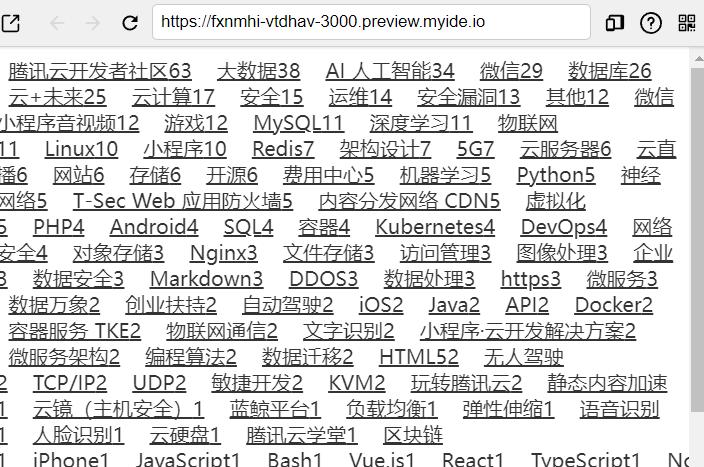
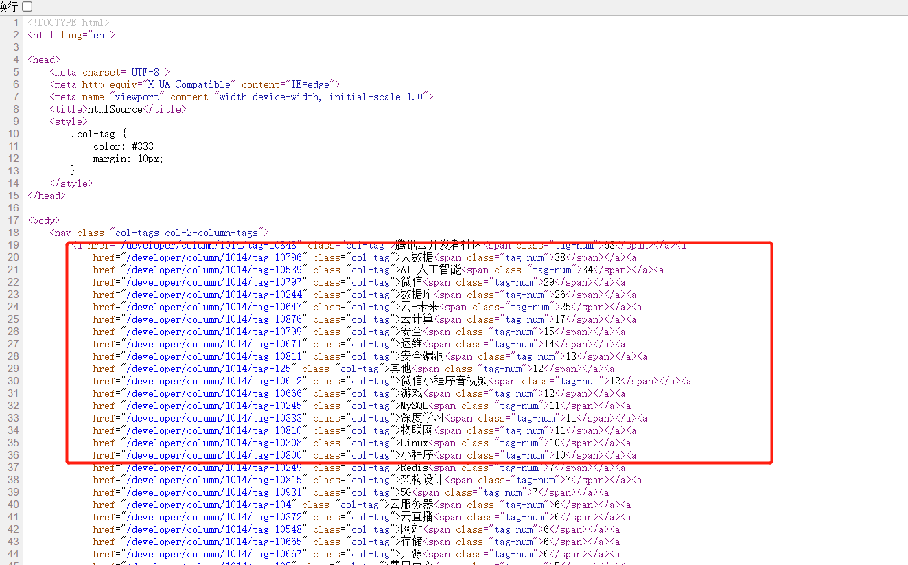
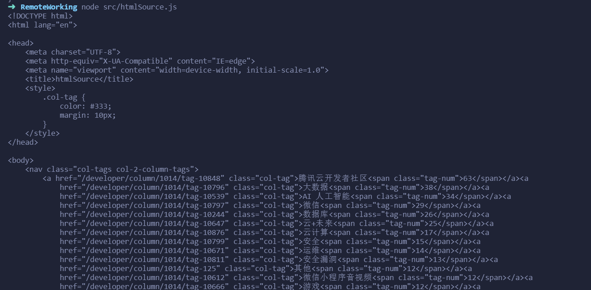
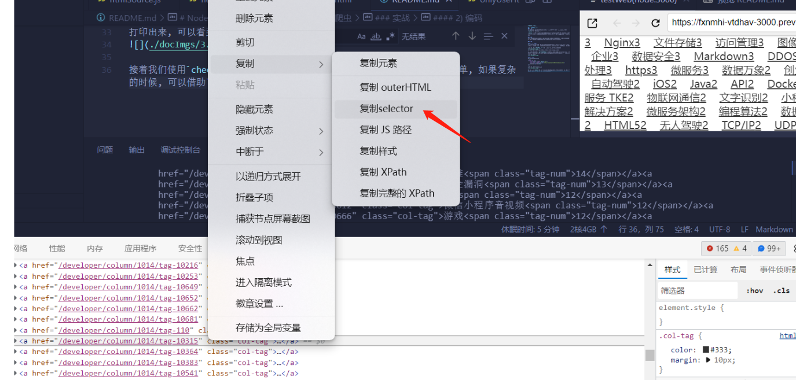
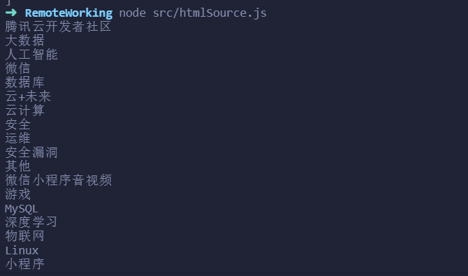
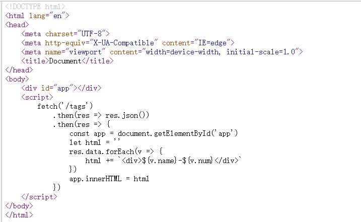
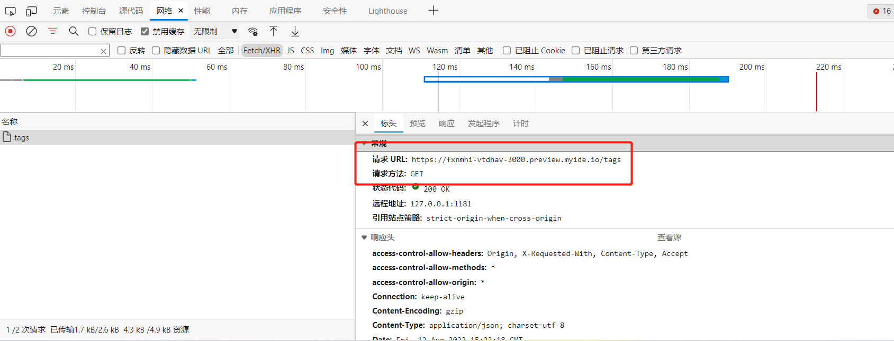
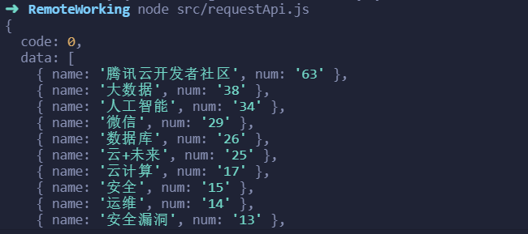

# NodeJS爬虫模板
[](https://cloudstudio.net/templates/h3mm9OTGWuz)

## 1. HTML源码爬虫
### 原理
通过get请求, 将网站HTML源码下载下来, 再使用正则匹配或者一些第三方库, 比如`cheerio`来简化读取的流程

`cheerio`是为服务器特别定制的，快速、灵活、实施的jQuery核心实现. 意思就是, 可以在非浏览器环境下, 用jq的方法来获取dom, 当然我们写爬虫, 就是拿到指定dom, 再把文本拿下来

### 缺点
只能爬取HTML源码存在的数据, 最笨的方法就是右键查看页面源代码, 搜索自己想要的数据, 如果搜索不到, 就需要考虑是否是js渲染上去的, 得用其他方法了

### 实战

#### 1) 观察页面
>我们可以查看预览页面, 如果没看到可以快捷键Command + Shift + P 或 Ctrl + Shift + P，打开命令面板，打开命令输入框，输入命令行 preview.start 即可重新打开预览窗口

进入主页, 点击`HTML源码爬虫`链接, 进入当前我们要测试爬取的页面

我们可以看到, 有很多tag在页面里, 这次任务就是把tag给爬下来. 

我们对预览窗口右键, `查看框架源代码`(注意这里主要预览页面是套在iframe中的, 所以是点这个, 看的更清晰一点), 可以看到我们想要tag数据都在HTML源码里可见, 所以可以以使用当前的爬取方式


#### 2) 编码
先用got来请求HTML源码
```js
;(async () => {
    const {got} = await import('got')
    const res = await got.get('http://localhost:3000/htmlSource.html')
    console.log(res.body)
})()
```
打印出来, 可以看到已经拿到了


接着我们使用`cheerio`来, 通过css选择器来获取指定文本, 这里结构比较简单, 如果复杂的时候, 可以借助`f12`打开的开发者工具来获取


通过选择器获取到想要的tag文本, 但是发现后面还有个数量的html, 所以再用正则过滤一下
```js
const $ = cheerio.load(res.body)
$('.col-tag').each((i, el)=> {
    const html = $(el).html()
    const name = html.match(/(\S+)<span/)[1]
    console.log(name)
})
```



### 4) 参考资料

 - https://github.com/cheeriojs/cheerio/wiki/Chinese-README
 - https://github.com/sindresorhus/got

## 2. 接口爬虫
### 原理
当我们查看页面源代码时, 发现并没有自己想要的数据, 这是数据就是通过js来渲染上去的, 无法直接通过下载源代码的方式获取. 这是我们通过对页面请求进行抓包, 可以获取数据接口, 再使用代码去请求接口, 从而获取数据

### 缺点
有些接口会存在鉴权和数据加密相关问题, 操作难度大

### 实战

#### 1) 观察页面
进入主页, 点击`接口爬虫`链接

我们可以看到, 页面内容还是之前的很多tag, 这是我们对预览窗口右键, `查看框架源代码`, 可以看到并没有这些tag的数据


这是我们可以`f12`打开开发者工具, 查看`网络(Network)`那个tab, 可以发现页面请求了一个`/tags`接口


#### 2) 编码
拿到了接口, 我们就可以直接请求拿数据啦
```js
;(async () => {
    const {got} = await import('got')
    const res = await got.get('http://localhost:3000/tags')
    console.log(JSON.parse(res.body))
})()
```



## 3. 无头浏览器爬虫(cloudStudio环境无法使用)
### 原理
就是通过无头浏览器来访问页面, 从而获取页面中的数据. 无头浏览器就是没有界面的浏览器, 可以使用`puppeteer`和`Playwright`等, 其实这些框架是设计用来进行自动化测试的, 我们顺便用来做爬虫还是很爽的, 如果有些点击操作等, 可以直接通过代码来自动完成(比如滑动验证码等)

### 缺点
由于还是通过打开浏览器来操作页面, 所以性能会差很多, 爬取的效率也很低, 所以非必要肯定不要考虑这种方式

### 实战

#### 1) 观察页面
进入主页, 点击`无头浏览器爬虫`链接

我们可以看到, 当前页面需要登录, 才能看到里面的内容, 这时候我们可以通过无头浏览器来自动填入数据登录, 进入后爬取页面数据

#### 2) 编码
首先我们先用puppeteer操作登录
```js
const puppeteer = require('puppeteer')

;(async () => {
  const browser = await puppeteer.launch()

  const page = await browser.newPage()
  page.goto('http://localhost:3000/headless.html')
  page.on('load', async () => {
    
    await page.type('#username', 'bob')
    await page.type('#password', 'bob')
    await page.tap('#login-btn')

    // 登录后的操作
    await browser.close()
  })
})()
```

#### 3) 参考资料

 - http://puppeteerjs.com/
